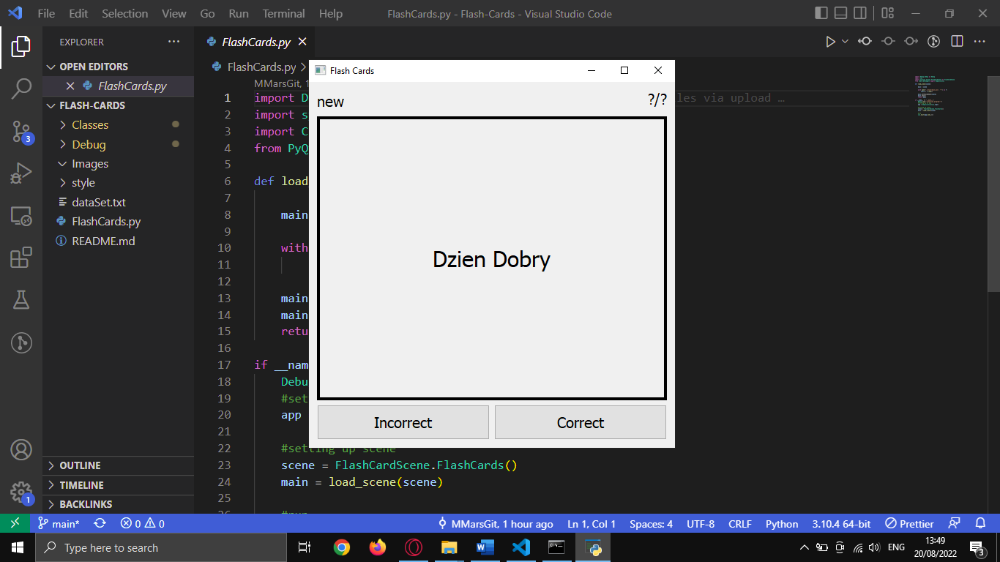

# Flash-Cards
This application creates flash cards similar to the flash card program Anki.  
The difference is that this flash card program takes some inserted text in the txt file and turns each words into a flash card  
from most frequent to least frequent.  
Additionally, after a flash card is completed it will be set to reappear based on a certain frequency.  
That frequency is: 1 day, 3 days, 7 days and then 30 days.  
For the translations Bab.la is scraped.  

## modules and libraries
PyQt - Used to create a GUI for the program.  
BeautifulSoup - Used to scrape Bab.la.  
SQLite - Used for database functionality.  

## Example Image

# Features and Priority
No. |Feature                                     |Priority |Stage       |
--- |------------------------------------------- |-------- |----------- |
1.0 |Flip Flash card                             |High     |Implemented |
2.0 |Incorrect button goes to next card          |High     |Implemented |
2.1 |Correct button goes to next card            |High     |Implemented |
3.0 |Incorrect button sets card to be sent again |Medium   |In Progress |
3.1 |Correct button sets card for 1 day time     |Medium   |In Progress |
3.2 |If pressed and set for 1 day set for 3 days |Medium   |In Progress |
3.3 |If 3 days 7 days                            |Medium   |In Progress |
3.4 |If 7 days 30 days                           |Medium   |In Progress |
4.0 |Set number of cards left                    |Medium   |Waiting     |
4.1 |Set card status                             |low      |Waiting     |
5.0 |Scrape translation of card from bab.la      |High     |Implemented |
6.0 |Style card and app to look nicer            |low      |Waiting     |